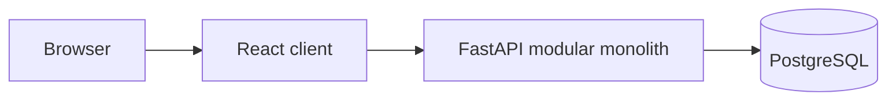

# E-commerce System Design Laboratory

A learning project that starts with a FastAPI modular monolith and evolves through measured system design experiments. The current backend covers authentication, catalog, inventory, cart, orders, and simulated payments. The React client currently focuses on administration; the full customer-facing journey is still being developed and verified.

The project uses PostgreSQL for the local Compose environment. Redis, messaging, independent services, and Kubernetes belong to later stages of the [roadmap](docs/roadmap_microservice.md).

## Current architecture



The payment simulator runs inside the API. A successful checkout first creates a `pending_payment` order; payment is a separate API request. Orders and inventory changes use local database transactions.

| Directory | Contents |
|---|---|
| `server/` | FastAPI application, SQLModel models, Alembic migrations, management commands, and API tests |
| `client/` | React, TypeScript, and Vite application |
| `load-tests/` | Locust scenarios for catalog reads, profile writes, checkout, and idempotency |
| `docs/` | Phase 0 foundation, architecture learning material, implementation plans, and review notes |
| `docker-compose.yml` | PostgreSQL, API, and client services for local development |

## Start locally with Docker Compose

Run these commands **from the repository root**. You need Docker with the Compose plugin and free host ports `5432`, `8000`, and `5173`.

The Compose file has development-only fallback values for `POSTGRES_PASSWORD` and `JWT_SECRET`. For your own local environment, place chosen values in a root `.env` file (which is Git-ignored):

```dotenv
POSTGRES_PASSWORD=choose-a-local-password
JWT_SECRET=replace-with-a-long-random-local-secret
VITE_API_URL=http://localhost:8000
```

Use a simple URL-safe local database password unless you encode special characters in the `DATABASE_URL` composed by `docker-compose.yml`. The root `.env` configures Compose; `server/.env.example` is for running the API outside Compose.

```bash
docker compose up --build -d
docker compose ps
```

The API container waits for PostgreSQL's health check and runs `alembic upgrade head` before starting Uvicorn. Verify each layer:

```bash
docker compose exec ecomm-postgrs-service pg_isready -U labadmin -d ecommerce
docker compose exec api alembic current
curl -fsS http://localhost:8000/health
```

`/health` confirms the API process responds; the `pg_isready` and Alembic commands check the database separately. Browse the admin client at **http://localhost:5173** and API docs at **http://localhost:8000/docs**. The client is a built static app served on port 5173, so frontend changes require a rebuild of the client container.

If startup fails, inspect the relevant container:

```bash
docker compose logs --tail=100 ecomm-postgrs-service api client
```

Stop the stack without deleting the bind-mounted PostgreSQL data:

```bash
docker compose down
```

Local database files live under `volumes/postgres_data/`. Treat that directory as local state, not as a Git backup.

## Create an administrator and sample data

After the API and database are running:

```bash
docker compose exec api python manage.py seed
docker compose exec api python manage.py createsuperuser
```

`createsuperuser` prompts for a username, email, name, and password. There is no preconfigured admin login.

For disposable local and load-test data, seed customers, published products, stock, and carts:

```bash
docker compose exec api python manage.py seed_fake --count 1000
```

The seeded customer names are `seed_user_000001` through `seed_user_001000` and use the test password printed by the seed command. `seed_fake` creates 100 units of stock per new product; checkout load tests can exhaust one product quickly, so provision enough stock for the complete run. Do not use these accounts or passwords in a public deployment.

## API flow

All business endpoints use `/api/v1`. The interactive docs at `/docs` show request schemas and responses.

1. Register or log in through `/api/v1/auth`; use the returned bearer token for protected requests.
2. An admin creates and publishes a product and adjusts stock through `/api/v1/admin/products` and `/api/v1/admin/inventory/adjustments`.
3. A customer browses `/api/v1/products` and manages `/api/v1/cart/items`.
4. The customer submits `POST /api/v1/orders` with a unique `Idempotency-Key` header. Repeating the same request/key returns the existing order.
5. The customer calls `POST /api/v1/payments/{order_id}/attempt` with its own `Idempotency-Key` and a simulated `success`, `failure`, or `timeout` outcome. An admin can resolve a timed-out result via `POST /api/v1/payments/{order_id}/resolve-timeout`.
6. An eligible order can be cancelled through `POST /api/v1/orders/{order_id}/cancellation`.

The payment routes simulate outcomes; they do not connect to a real payment provider or store card details.

## Tests and load scenarios

The existing API regression suite uses a disposable **SQLite** database and covers selected order/payment invariants:

```bash
docker compose exec api python -m pytest -q tests/test_order_payment_invariants.py
```

For Locust, run from the repository root with Locust installed on the load-generator machine. Run one user class per test so the endpoint percentiles remain interpretable:

```bash
locust -f load-tests/locustfile.py --headless -H http://localhost:8000 -u 100 -r 10 -t 10m CatalogReadUser
```

`ProductDetailReadUser` and `CheckoutUser` require `PERF_PRODUCT_ID` to point to a published product. `CheckoutUser` creates orders and completes simulated payments against real local inventory. It reports order and payment HTTP latencies separately. Record the dataset, application worker count, machine resources, warm-up, throughput, P50/P95/P99, and unexpected errors for every benchmark.

## Project status and next work

- [Phase 0 foundation](docs/phase_0_foundation.md) documents the MVP scope, initial estimates, context diagram, and PostgreSQL decision. Some examples in that document describe the original database-only scaffold; the Compose commands above reflect the current repo.
- [Server assessment](docs/phase0_server_review.md) tracks implemented areas and gaps. The last-item concurrency exercise and payment-state migration still need verification on PostgreSQL; SQLite API tests do not prove PostgreSQL row-lock behavior.
- The P95/error-rate values are **targets**, not measured performance claims. A seeded, repeatable Locust baseline is still needed before comparing architecture changes.
