# Practical Microservices and System Design Roadmap

## E-commerce from MVP Monolith to Million-User Architecture

This roadmap uses a simplified e-commerce application as a laboratory for learning microservices and system design through implementation, measurement, failure testing, and architectural evolution.

The intended progression is:

> **Monolith → Modular Monolith → Scaled Monolith → Distributed Services → Event-Driven Architecture → Resilient Microservices → Cloud-Native System → Million-User Design**

The goal is not merely to build an e-commerce application. The goal is to understand why architectural patterns exist, which problems they solve, and what trade-offs they introduce.

---

## 1. Learning Method

Use this cycle for every concept:

1. Learn the concept.
2. Identify the problem it solves.
3. Reproduce that problem in the application.
4. Measure the current behavior.
5. Implement the solution.
6. Run the same test again.
7. Compare before and after results.
8. Record the decision and trade-offs in an **Architecture Decision Record (ADR)**.

Example:

| Measurement | Before Redis | After Redis |
|---|---:|---:|
| **Product API P95 latency** | 450 ms | 55 ms |
| Database CPU | 80% | 25% |

The core rule throughout this project is:

> **Problem → Architectural limitation → System design concept → Technology**

Do not add a technology merely because it is popular.

---

## 2. Application Scope

### MVP customer features

- Register and log in
- Browse and filter products
- Search products
- Add, update, and remove cart items
- Checkout
- Place an order
- Make a simulated payment
- View order history and details
- Cancel an eligible order

### MVP admin features

- Manage products and categories
- Manage inventory
- View and update orders
- View users

### Later features

- Reviews and ratings
- Wishlist
- Coupons and promotions
- Notifications
- Shipment tracking
- Recommendations
- Analytics
- Full-text search
- Fraud detection
- Flash sales

---

## 3. Recommended Technology Stack

Introduce each component only in the phase where it solves a demonstrated problem.

| Area | Technology |
|---|---|
| Frontend | React, TypeScript, Vite |
| Backend | Python, FastAPI |
| Primary database | PostgreSQL |
| Cache and ephemeral data | Redis |
| Messaging | RabbitMQ |
| Background jobs | Celery |
| Search | Elasticsearch or OpenSearch |
| API gateway/load balancer | FastAPI gateway, Nginx, Traefik, or Kong |
| Object storage | MinIO locally; S3-compatible storage later |
| Containers | Docker, Docker Compose |
| Orchestration | Kubernetes, introduced late |
| Metrics | Prometheus |
| Dashboards | Grafana |
| Logs | Loki or ELK |
| Tracing | OpenTelemetry with Jaeger or Tempo |
| Load testing | k6 or Locust |
| CI/CD | GitHub Actions |

---

## 4. Suggested Repository Structure

Use Git tags to preserve architectural milestones while keeping one evolving codebase.

```text
ecommerce-system-design/
├── server/
├── client/
├── services/
├── infrastructure/
├── load-tests/
├── scripts/
├── docs/
│   ├── requirements/
│   ├── architecture/
│   ├── adr/
│   ├── diagrams/
│   ├── benchmarks/
│   ├── incidents/
│   └── capacity-plans/
├── docker-compose.yml
└── README.md
```

Suggested tags:

```text
v1-monolith
v2-modular-monolith
v3-database-optimized
v4-load-tested
v5-redis
v6-horizontal-scaling
v7-async-processing
v8-first-microservice
v9-event-driven
v10-observability
v11-resilient
v12-kubernetes
v13-million-user-design
```

---

# Phase-by-Phase Roadmap

## Phase 0 — Define Requirements and Baselines

### Purpose
Phase 0 creates the foundation and measurable starting point for the entire project.

Before building features or adding technologies like Redis, RabbitMQ, or Kubernetes, you define:

- What the system must do: customer and admin MVP scope.
- How well it must work: latency, availability, throughput, and data durability targets.
- How the system will be measured: metrics such as P95 latency, error rate, database load, and throughput.
- How developers will run it: a repeatable Docker Compose development environment.
- What major decisions are being made: architecture diagrams and ADRs.
- The key idea is to avoid adding technology based on popularity or assumption. For example, you should not add Redis merely because “large systems use Redis.” First, establish that a measurable problem exists, such as slow product reads or excessive database load. Then introduce Redis and compare the results.

Phase 0 answers:

> **What are we building, what constraints matter, how will we measure success, and what is our initial architecture?**

Its main deliverables are:

- MVP requirements
- Initial architecture diagram
- PostgreSQL decision record
- Local Docker Compose setup

### Build

- Define functional and non-functional requirements.
- Choose initial assumptions for users, products, and orders.
- Define API response conventions and error format.
- Create a high-level architecture diagram.
- Establish a repeatable local development environment.

### Learn

- Functional vs non-functional requirements
- Availability, latency, throughput, durability, and consistency
- Service-level indicators and objectives
- Back-of-the-envelope estimation
- Architecture diagrams and ADRs

### Deliverables

- `docs/requirements/mvp.md`
- `docs/architecture/context.md`
- ADR 001: Use PostgreSQL as the initial database
- Initial Docker Compose environment

### Completion criteria

- The MVP boundary is explicit.
- Target latency and availability are written down.
- The application can be started with a documented command.

---

## Phase 1 — Build the MVP Monolith

**Estimated time:** 2–3 weeks

### Architecture

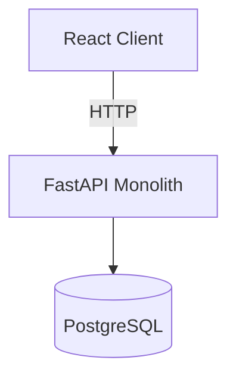

Keep authentication, catalog, inventory, cart, order, and payment modules in one deployable application and one database.

### Suggested server structure

```text
server/app/
├── auth/
├── users/
├── products/
├── inventory/
├── cart/
├── orders/
├── payments/
├── core/
└── main.py
```

### Implement

- Authentication with password hashing and JWT
- Product and category CRUD
- Inventory management
- Persistent shopping cart
- Order creation and history
- Simulated payment flow
- Admin authorization
- Input validation and consistent errors
- Database migrations and automated tests

### Learn

- HTTP and REST
- Authentication and authorization
- SQL and relational modeling
- Constraints, indexes, and transactions
- ORM, migrations, and connection pooling
- Layered architecture and dependency injection
- Validation, error handling, and API testing

### Experiments

- Attempt to place an invalid order and verify transaction rollback.
- Try duplicate emails and invalid foreign keys.
- Observe the SQL generated by the ORM.
- Verify authorization for customer and admin roles.

### Completion criteria

- A customer can complete the full browse-to-order journey.
- Core flows have integration tests.
- The database enforces important invariants.
- No Redis, broker, microservice, or Kubernetes dependency exists yet.

---

## Phase 2 — Convert to a Modular Monolith

Separate the code into strong business modules while retaining one deployment and database.

### Domain boundaries

- Identity
- Catalog
- Inventory
- Cart
- Order
- Payment
- Notification

### Learn

- Domain-Driven Design basics
- Bounded contexts
- High cohesion and low coupling
- Dependency inversion
- Application, domain, and infrastructure layers
- Repository and service patterns
- Commands, queries, and domain events

### Implement

- Prevent modules from importing another module's database model directly.
- Expose module capabilities through explicit interfaces.
- Move business rules out of API route handlers.
- Introduce internal domain events where useful.
- Add module-level tests.

### Experiment

Change the inventory implementation without changing the order module's core logic. Any difficult dependency indicates a weak boundary.

### Completion criteria

- Each module has clear ownership of its rules and data access.
- Cross-module calls happen through defined interfaces.
- Candidate future microservices are visible without creating network calls.

---

## Phase 3 — Database System Design and Concurrency

Generate enough data to expose inefficient queries.

### Suggested test dataset

| Entity | Records |
|---|---:|
| Users | 1,000,000 |
| Products | 500,000 |
| Orders | 5,000,000 |
| Order items | 15,000,000 |

Start smaller if local hardware is limited, but preserve realistic distributions and skew.

### Learn

- Normalization and denormalization
- B-tree and composite indexes
- Query planners and `EXPLAIN ANALYZE`
- Transactions and isolation levels
- Locks and deadlocks
- Optimistic and pessimistic concurrency control
- Offset and cursor pagination
- Connection pool sizing

### Experiments

1. Query recent orders for a user without an index.
2. Record the execution plan and latency.
3. Add a composite index on `(user_id, created_at DESC)`.
4. Repeat and compare.
5. Create two simultaneous purchases when inventory equals one.
6. Solve overselling first with `SELECT ... FOR UPDATE`, then with optimistic versioning.
7. Intentionally produce and diagnose a deadlock.

### Deliverables

- Reproducible data generator
- Slow-query collection
- Before/after query plans
- Database index rationale
- Concurrency test suite

### Completion criteria

- Inventory cannot become negative under concurrent checkout.
- Critical queries have measured, justified indexes.
- The team can explain chosen isolation and locking behavior.

---

## Phase 4 — Performance and Load Testing

Create reproducible tests with k6 or Locust.

### Test profiles

- Baseline: normal expected traffic
- Load: increasing traffic within expected capacity
- Stress: continue until the system fails
- Spike: sudden traffic surge
- Soak: sustained traffic to reveal leaks and exhaustion

### Measure

- Requests per second
- P50, P95, and P99 latency
- Error rate
- CPU and memory
- Database CPU and active connections
- Slow queries
- Saturated resources

### Important principle

Do not report only averages. Tail latency and errors often reveal the real user experience.

### Deliverables

- Versioned load-test scripts
- Baseline benchmark report
- Bottleneck hypothesis and evidence
- Capacity limit for the current architecture

### Completion criteria

- The same test can be rerun after every major architectural change.
- At least one real bottleneck has been located using measurements.

---

## Phase 5 — Horizontally Scale the Monolith

### Architecture

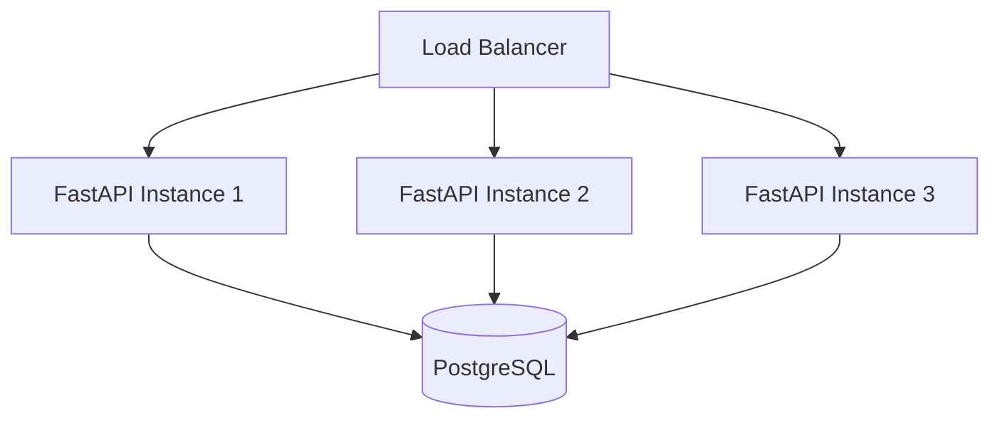

### Implement

- Run multiple FastAPI instances.
- Add Nginx or Traefik load balancing.
- Add health checks.
- Remove process-local session dependencies.
- Verify graceful shutdown and connection draining.

### Learn

- Vertical vs horizontal scaling
- Stateless services
- Round-robin and least-connections balancing
- Health, readiness, and liveness checks
- Sticky sessions and why they can be limiting
- Shared state and connection pool multiplication

### Experiments

- Kill one instance during a load test.
- Compare one large instance with several smaller instances.
- Observe database connections as instance count increases.
- Demonstrate why in-memory sessions fail across instances.

### Completion criteria

- Any application instance can serve any request.
- Instance termination does not cause a major outage.
- Database connection usage remains controlled.

---

## Phase 6 — Introduce Redis

Start with cache-aside for the product catalog.

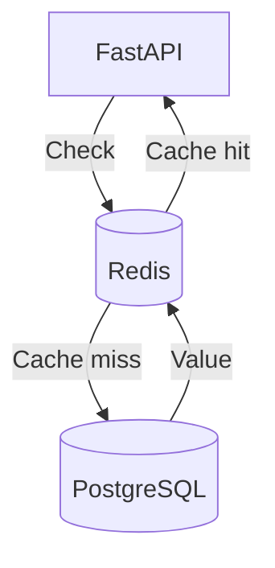

### Learn

- Cache-aside pattern
- TTL selection
- Cache invalidation
- Cache stampede and request coalescing
- Hot keys and eviction policies
- Distributed sessions and rate-limit counters
- When not to cache

### Implement progressively

1. Product-detail caching
2. Product-list caching where appropriate
3. Session or temporary-token storage
4. Cart storage, after evaluating durability requirements
5. Rate-limiting counters

### Experiments

- Compare cache disabled, cold cache, and warm cache.
- Update a product and detect stale reads.
- Expire a hot key while many requests arrive.
- Make Redis unavailable and verify graceful degradation.

### Completion criteria

- Cache invalidation behavior is documented.
- Benchmarks demonstrate whether Redis improved the intended metric.
- Redis failure does not silently corrupt business data.

---

## Phase 7 — Add Asynchronous Processing

Move non-critical work out of the synchronous checkout path.

### Candidates

- Email notification
- Invoice generation
- Analytics emission
- Warehouse notification
- Image processing

### Implement

- RabbitMQ as broker
- Celery workers
- Retry with exponential backoff and jitter
- Dead-letter handling
- Idempotency keys or deduplication
- Task status and operational visibility

### Learn

- Producer, exchange, queue, binding, and consumer
- Acknowledgements and prefetch
- At-least-once delivery
- Why exactly-once delivery is usually an application-level illusion
- Poison messages
- Backpressure and queue depth

### Experiments

- Crash a worker after processing but before acknowledgement.
- Publish the same task twice.
- Force repeated failures into a dead-letter queue.
- Compare checkout latency before and after offloading work.

### Completion criteria

- Duplicate task delivery does not duplicate customer-visible side effects.
- Failed work is observable and recoverable.
- Checkout latency improvement is measured.

---

## Phase 8 — Extract the First Microservice

Extract the Notification service first because it is comparatively low risk and naturally event-driven.

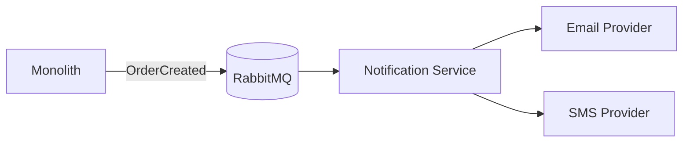

### Learn

- Service boundaries and ownership
- Independent deployment
- API and event contracts
- Network failure modes
- Configuration and secret management
- Service discovery
- Distributed debugging

### Implement

- Versioned `OrderCreated` event contract
- Independent service image and deployment
- Consumer idempotency
- Contract tests
- Retry and dead-letter behavior

### Completion criteria

- The notification service is independently deployable.
- The ordering flow works even when notification is temporarily unavailable.
- Event compatibility is tested.

---

## Phase 9 — Extract Core Business Services

Extract only when a boundary has a valid reason such as different scaling, release cadence, ownership, reliability, or data needs.

### Target services

| Service | Likely data store | Responsibility |
|---|---|---|
| Identity | PostgreSQL | Accounts, roles, authentication |
| Catalog | PostgreSQL | Products, categories, pricing metadata |
| Cart | Redis, with evaluated persistence | Active shopping carts |
| Order | PostgreSQL | Order lifecycle and history |
| Inventory | PostgreSQL | Stock and reservations |
| Payment | PostgreSQL | Payment attempts and provider integration |
| Notification | Its own persistence as needed | Email/SMS/push delivery |
| Search | Elasticsearch/OpenSearch | Product search projection |

### Learn

- Database per service
- Synchronous vs asynchronous communication
- Data ownership and duplication
- API composition
- Service discovery and configuration
- Contract evolution
- Deployment coupling

### Important rule

One service must not directly query another service's database. Cross-service data is obtained through an API, event, or maintained local projection.

### Completion criteria

- Every extracted service has a documented reason to exist.
- Database ownership is explicit.
- Cross-service contracts are versioned and tested.

---

## Phase 10 — Distributed Transactions with Saga

Implement the checkout workflow across services:

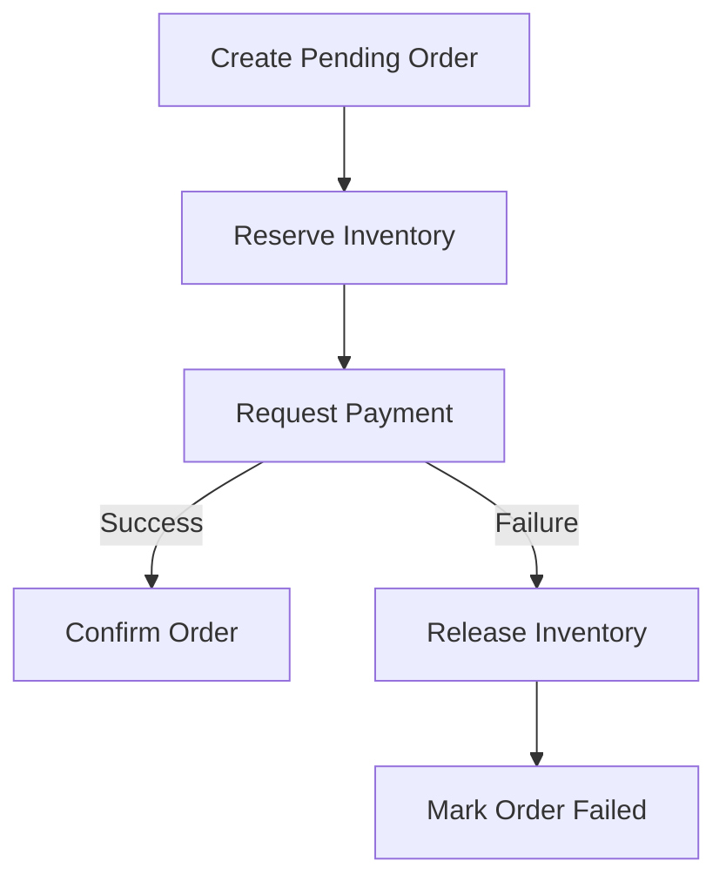

### Learn

- Why local ACID transactions do not span services
- Two-phase commit and its limitations
- Saga orchestration vs choreography
- Compensating transactions
- Semantic rollback
- Timeouts, duplicate commands, and late responses

### Experiments

- Payment fails after inventory reservation.
- Payment succeeds but the response is lost.
- Inventory reservation times out but completes late.
- The same checkout command is delivered twice.
- The orchestrator restarts midway through a saga.

### Completion criteria

- Every saga step is idempotent.
- Each failure path has a defined compensation or manual-recovery path.
- Saga state is durable and inspectable.

---

## Phase 11 — Event-Driven Architecture and Transactional Outbox

Use integration events for independently reacting services.

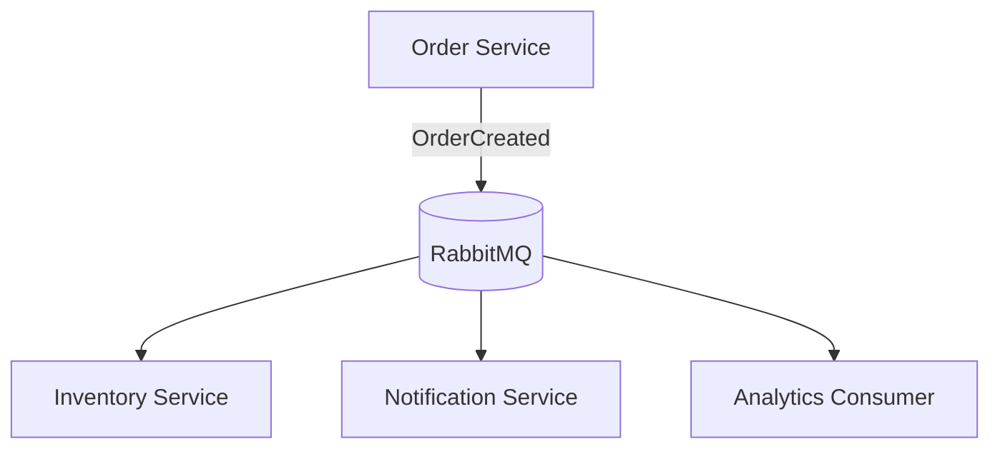

### Learn

- Domain events vs integration events
- Pub/sub and competing consumers
- Eventual consistency
- Event versioning and schema compatibility
- Event ordering, deduplication, and replay
- Transactional Outbox and Inbox patterns

### Transactional Outbox problem

Without an outbox, saving an order may succeed while event publication fails. Store the order and an outbox record in the same local database transaction. A relay publishes pending outbox records and marks them processed.

### Experiments

- Stop RabbitMQ after committing an order.
- Restart the publisher and verify eventual delivery.
- Redeliver the same event.
- Process events out of order.
- Introduce a compatible event schema version.

### Completion criteria

- No committed business event is lost due to a broker outage.
- Consumers handle duplicate delivery.
- Event ownership and compatibility rules are documented.

---

## Phase 12 — Add an API Gateway

### Responsibilities

- Routing
- Authentication verification
- Rate limiting
- CORS
- Correlation and trace IDs
- Request logging
- Limited response aggregation
- API version routing

### Learn

- Reverse proxy vs API gateway
- Edge authentication vs service authorization
- North-south vs east-west traffic
- Gateway timeout budgets
- Avoiding business logic in the gateway

### Experiments

- Apply different rate limits by user and endpoint.
- Propagate a correlation ID through all downstream services.
- Make a downstream service slow and verify the gateway timeout.

### Completion criteria

- External clients have one stable API entry point.
- Services still enforce their own authorization requirements.
- Gateway failure and scaling behavior are understood.

---

## Phase 13 — Search Architecture

Build a search projection from catalog events instead of querying product names with slow wildcard SQL.

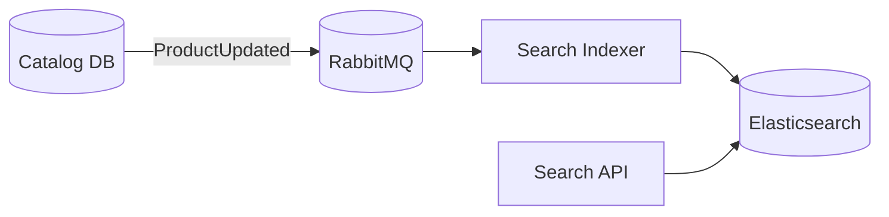

### Learn

- Inverted indexes
- Tokenization and analyzers
- Full-text ranking
- Filters vs queries
- Eventual consistency
- Reindexing and alias swaps
- Search projection repair

### Experiments

- Measure catalog update-to-search visibility delay.
- Rebuild the entire search index from source data.
- Introduce a new index mapping without downtime.

### Completion criteria

- PostgreSQL remains the catalog source of truth.
- Search indexes can be rebuilt.
- Staleness behavior is visible and acceptable.

---

## Phase 14 — Observability

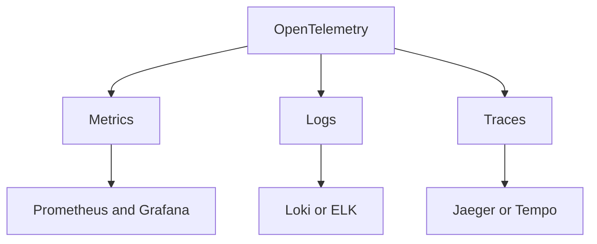

### Implement

- Structured logs
- Request and correlation IDs
- Distributed tracing
- Prometheus service and business metrics
- Grafana dashboards
- Alerts for user-impacting symptoms

### Learn

- Logs, metrics, and traces
- Trace context and spans
- RED metrics: rate, errors, duration
- USE metrics: utilization, saturation, errors
- Cardinality management
- Symptoms vs causes in alerting

### Suggested dashboards

- API request rate, errors, and P95/P99 latency
- Database connections, locks, and query duration
- Queue depth, consumer lag, retry rate, DLQ size
- Cache hit rate and eviction count
- Order success, failure, cancellation, and payment rates

### Completion criteria

- A slow checkout can be traced across gateway, order, inventory, and payment.
- Alerts identify user impact without excessive noise.
- Logs do not expose secrets or sensitive payment information.

---

## Phase 15 — Reliability and Resilience

Deliberately inject failures.

### Implement

- Timeouts
- Bounded retries with exponential backoff and jitter
- Circuit breakers
- Bulkheads
- Fallbacks where semantically safe
- Dead-letter queues
- Readiness and liveness checks
- Graceful degradation

### Learn

- Retry storms and retry budgets
- Cascading failure
- Failure isolation
- Partial availability
- Backpressure
- Recovery objectives

### Failure scenarios

| Scenario | Expected behavior |
|---|---|
| Payment returns in 100 ms | Normal checkout |
| Payment takes 10 seconds | Timeout; do not hold resources indefinitely |
| Payment returns 50% errors | Controlled retries and circuit opening |
| Payment is offline | Orders remain recoverable; system avoids cascade |
| RabbitMQ is unavailable | Outbox retains events |
| Redis is unavailable | Defined degraded behavior |
| One instance is killed | Load balancer routes around it |

### Completion criteria

- Every remote call has a timeout.
- Retry behavior is safe and bounded.
- Dependency failures do not automatically become full-system outages.

---

## Phase 16 — Distributed Rate Limiting and Abuse Protection

### Implement

- Per-user limits
- Per-IP limits
- Endpoint-specific limits
- Separate limits for authentication and checkout
- Redis-backed token bucket or sliding-window algorithm

### Learn

- Fixed window, sliding window, and token bucket
- Fairness and burst allowance
- Distributed atomicity
- Throttling vs rejection
- Backpressure and bot protection

### Experiments

- Send a large burst from one user.
- Distribute requests across application instances.
- Make Redis unavailable and define fail-open vs fail-closed behavior by endpoint.

### Completion criteria

- Limits are consistent across instances.
- Responses communicate retry behavior correctly.
- Critical endpoints have stricter protection.

---

## Phase 17 — Database Scaling

### Learn and implement progressively

1. Query and schema optimization
2. Connection pooling
3. Caching
4. Read replicas
5. Table partitioning
6. Archival and retention
7. Sharding only when justified

### Learn

- Primary/replica architecture
- Replication lag and stale reads
- Read-after-write consistency
- Partition pruning
- Horizontal sharding
- Consistent hashing
- Rebalancing and hot shards
- CQRS where distinct read models add value

### Experiments

- Route eligible reads to replicas.
- Demonstrate stale reads after a write.
- Partition orders by date and compare maintenance/query behavior.
- Model user-based sharding and cross-shard queries.

### Completion criteria

- Read routing respects consistency requirements.
- Partition or shard keys are selected from access patterns, not guesswork.
- Operational costs and failure modes are documented.

---

## Phase 18 — CDN and Object Storage

Do not serve product media through FastAPI.

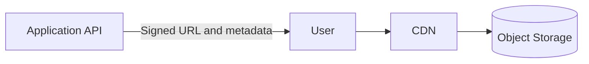

### Learn

- Object storage
- CDN and edge caching
- Cache headers and invalidation
- Signed upload/download URLs
- Image variants and lifecycle rules

### Experiments

- Compare application-served images with object-storage/CDN delivery.
- Test cache headers and invalidation.
- Upload directly using a signed URL.

### Completion criteria

- Media traffic does not consume application worker capacity.
- Access control and expiration are defined.

---

## Phase 19 — Kubernetes

Introduce Kubernetes only when operating many containers in Docker Compose has become a genuine constraint.

### Learn

- Pods, Deployments, and Services
- ConfigMaps and Secrets
- Ingress
- Resource requests and limits
- Liveness, readiness, and startup probes
- Rolling deployments
- Horizontal Pod Autoscaler
- Namespaces
- Persistent storage

### Implement

- Deploy stateless services first.
- Add readiness and liveness probes.
- Define CPU and memory requests/limits.
- Perform a rolling update.
- Scale high-demand services independently.

### Experiments

- Kill pods during a load test.
- Roll out a bad version and roll back.
- Simulate an unavailable dependency and observe readiness behavior.

### Completion criteria

- Deployments are repeatable.
- Rolling updates do not cause visible downtime.
- Probes reflect real service health.

---

## Phase 20 — Autoscaling

### Learn

- Horizontal and vertical autoscaling
- CPU, latency, and queue-based signals
- Scale-up delay and cold starts
- Minimum/maximum replicas
- Stabilization windows
- Why database capacity may limit application scaling

### Experiment

Create two traffic patterns:

- Normal: 100 requests/second
- Flash spike: 20,000 requests/second or the highest safe local equivalent

Observe pods, latency, errors, queue depth, database load, and recovery after traffic falls.

### Completion criteria

- Scaling policies are based on measured signals.
- Autoscaling does not overload downstream dependencies.
- Queue consumers can scale from backlog where appropriate.

---

## Phase 21 — Flash-Sale Design Challenge

### Scenario

- Product inventory: 100 units
- Interested users: 1,000,000
- Purchase window: 10 seconds

### Problems to solve

- Overselling
- Database contention
- Queue overload
- Bots
- Duplicate purchases
- Fairness
- User feedback while requests wait

### Candidate architecture

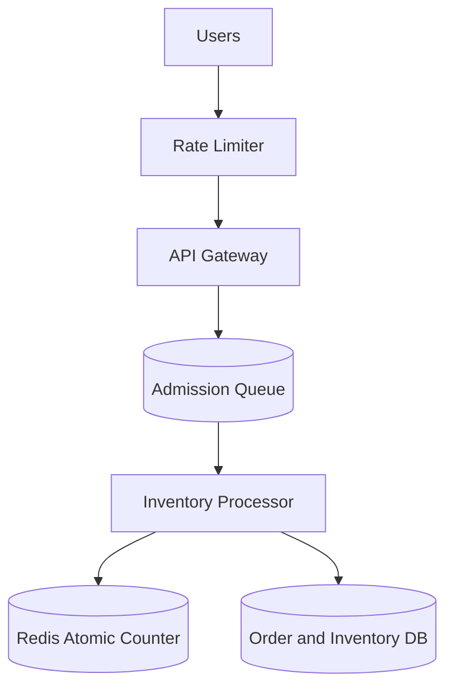

### Experiments

- Compare direct database locking with queued admission.
- Use idempotency keys for duplicate clicks.
- Verify that confirmed sales never exceed inventory.
- Measure queue wait time and rejection behavior.
- Test counter/database reconciliation after failure.

### Completion criteria

- No overselling under the tested workload.
- Duplicate requests do not produce duplicate orders.
- The design explicitly discusses fairness, durability, and recovery.

---

## Phase 22 — Design for One Million Active Users

Set concrete assumptions before drawing the architecture.

### Example requirements

| Metric | Assumption |
|---|---:|
| Registered users | 10 million |
| Daily active users | 1 million |
| Concurrent users | 100,000 |
| Products | 5 million |
| Orders per day | 500,000 |
| Peak total API traffic | 50,000 requests/second |

### Estimation example

Average order rate:

```text
500,000 / 86,400 ≈ 5.8 orders/second
```

At a 20× peak factor:

```text
5.8 × 20 ≈ 116 orders/second
```

### Calculate

- Read and write requests per second
- Peak concurrency
- Database storage growth
- Index overhead
- Image/object storage
- Network bandwidth
- Cache working set
- Broker throughput and backlog
- Worker count
- Expected failure capacity

### Final architecture direction

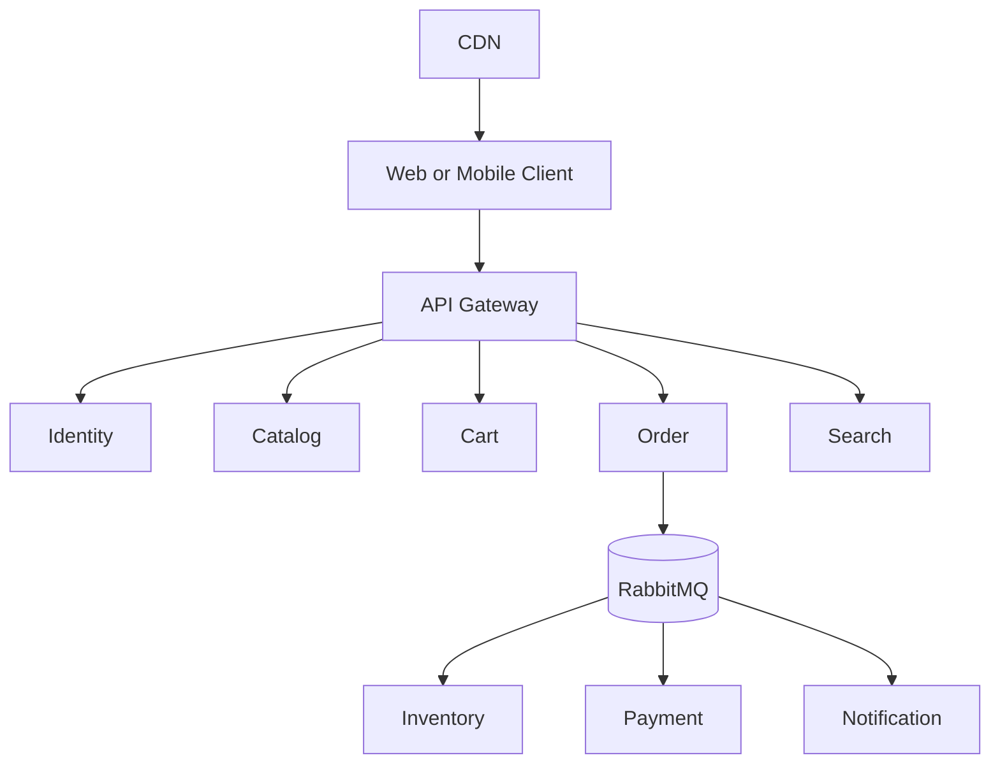

Each service owns an appropriate data store; PostgreSQL remains suitable for transactional services, Redis for low-latency ephemeral data, and Elasticsearch/OpenSearch for search projections.

### Completion criteria

- Every major component is tied to a stated requirement.
- Capacity estimates show assumptions and safety margins.
- Consistency, availability, latency, cost, and operational trade-offs are explicit.
- The design identifies likely bottlenecks and scaling thresholds.

---

# Six-Month Execution Plan

This schedule assumes part-time work alongside a normal job. Preserve the order even if the duration changes.

| Month | Main focus | Target application state |
|---|---|---|
| 1 | FastAPI, PostgreSQL, REST, data modeling, transactions | MVP monolith |
| 2 | Modular design, database performance, load testing, Redis | Scalable modular monolith |
| 3 | RabbitMQ, Celery, asynchronous work, horizontal scaling | Event-enabled monolith |
| 4 | Service extraction, gateway, database per service, Saga, Outbox | Distributed system |
| 5 | Search, observability, reliability, rate limiting | Production-like microservices |
| 6 | Database scaling, Kubernetes, autoscaling, chaos and flash-sale tests | Million-user architecture model |

## Weekly rhythm

Use a repeatable learning rhythm:

- **Day 1:** Learn the concept and state a hypothesis.
- **Day 2–3:** Build the smallest implementation.
- **Day 4:** Test normal and failure behavior.
- **Day 5:** Load test and collect measurements.
- **Day 6:** Document the ADR and benchmark.
- **Day 7:** Review, refactor, and create the next experiment.

---

# Architecture Decision Records

Suggested ADRs:

```text
docs/adr/
├── 001-use-postgresql.md
├── 002-adopt-modular-monolith.md
├── 003-add-redis-cache.md
├── 004-introduce-rabbitmq-and-celery.md
├── 005-extract-notification-service.md
├── 006-adopt-database-per-service.md
├── 007-use-saga-orchestration.md
├── 008-add-transactional-outbox.md
├── 009-add-search-projection.md
└── 010-adopt-kubernetes.md
```

Each ADR should contain:

```markdown
# Title

## Status
Proposed / Accepted / Superseded

## Context and problem

## Constraints

## Options considered

## Decision

## Advantages

## Disadvantages and risks

## Operational consequences

## Benchmark or evidence

## Revisit conditions
```

---

# Benchmark Template

For every architectural change, capture comparable evidence.

```markdown
# Benchmark: <change>

## Hypothesis

## Environment
- CPU/RAM:
- Application instances:
- Database configuration:
- Dataset size:
- Tool and script version:

## Workload
- Endpoint/workflow:
- Concurrent users:
- Duration:
- Request distribution:

## Before
- Throughput:
- P50/P95/P99:
- Error rate:
- CPU/memory:
- DB connections/CPU:

## After
- Throughput:
- P50/P95/P99:
- Error rate:
- CPU/memory:
- DB connections/CPU:

## Conclusion

## Trade-offs and follow-up
```

---

# Knowledge Checklist

By the end of the roadmap, you should be able to explain and demonstrate:

| Area | Concepts |
|---|---|
| APIs | HTTP, REST, pagination, idempotency, versioning |
| Architecture | Monolith, modular monolith, microservices |
| Domain design | DDD basics, bounded contexts, cohesion, coupling |
| Databases | Indexes, transactions, isolation, locks, replication |
| Scaling | Vertical/horizontal scaling, load balancing, autoscaling |
| Caching | Cache-aside, TTL, invalidation, stampede, hot keys |
| Messaging | Queues, pub/sub, acknowledgements, retries, DLQ |
| Async work | Celery workers, idempotency, backpressure |
| Distributed systems | CAP trade-offs, eventual consistency, failure modes |
| Transactions | Saga, compensations, Outbox, Inbox |
| Reliability | Timeouts, retries, circuit breakers, bulkheads |
| Networking | DNS, proxy, load balancer, API gateway |
| Security | JWT, authorization, secrets, abuse controls |
| Search | Inverted index, analyzers, ranking, reindexing |
| Storage | Object storage, CDN, signed URLs |
| Observability | Logs, metrics, traces, SLI/SLO, alerting |
| Performance | Load, stress, spike, and soak testing |
| Data scaling | Read replicas, partitioning, sharding, CQRS |
| Deployment | Docker, Kubernetes, rolling updates, CI/CD |
| Resilience | Chaos testing, graceful degradation, recovery |

---

# Final Project Portfolio Deliverables

At the end, the repository should demonstrate not only working code but architectural reasoning:

- Working e-commerce user and admin flows
- Automated unit, integration, contract, and concurrency tests
- Docker Compose local environment
- Reproducible load-test suite
- Before/after benchmark reports
- Versioned API and event contracts
- ADR collection
- Failure-injection reports
- Observability dashboards
- Kubernetes manifests or Helm charts
- Capacity plan for one million daily active users
- Final architecture diagram
- Retrospective explaining which technologies helped, which did not, and why

---

# Rules to Keep the Learning Effective

1. Start with one deployable application and one database.
2. Create evidence before adding infrastructure.
3. Preserve each important stage with a Git tag.
4. Measure P95/P99 latency and errors, not only averages.
5. Test failure paths as seriously as success paths.
6. Treat messages and commands as potentially duplicated.
7. Give every remote call a timeout.
8. Keep business invariants close to their owning service.
9. Never share a service database as an integration shortcut.
10. Prefer the simplest architecture that meets the current measured need.
11. Record why a decision was made and when it should be revisited.
12. Do not claim million-user readiness from a diagram alone—support it with estimates, tests, and clearly stated assumptions.

The finished project should tell a coherent engineering story: a simple monolith was built, measured, stressed, and evolved one justified architectural decision at a time into a scalable and resilient distributed system.
